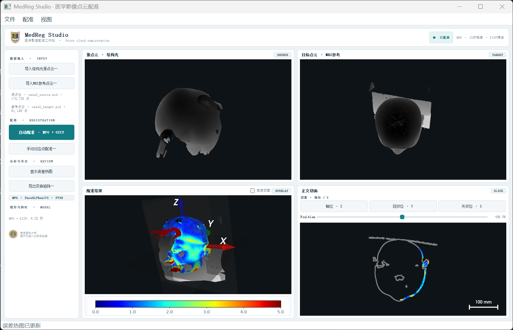

# RegistrationTool

RegistrationTool is a local Qt desktop application for rigid registration of
source and reference point clouds. Processing runs on the workstation; point
clouds are not uploaded to a remote service.



## Features

- Four work areas for source, reference, registration result, and orthogonal slice inspection.
- Local MPG registration followed by GICP refinement.
- Manual point correspondence with GICP refinement.
- Nearest-neighbour error heatmap with a millimetre scale.
- Axial, coronal, and sagittal slice selection, position control, and slice locking.
- Transform export as `.txt` or `.npy`.
- Three source/reference PCD example pairs under `cases/`.

## Requirements

Use a Python environment with PyTorch, Open3D, PyQt5, VTK, and Matplotlib.
CUDA is optional; CPU inference is supported.

## Run

From the repository root:

```powershell
$env:REG_DEVICE = "cuda:0"
python main.py
```

Omit `REG_DEVICE` or set it to `cpu` to use the CPU. Import a source PCD and a
reference PCD, then choose **自动配准**. The application centers each cloud
before inference and restores the resulting transform to the original input
coordinate frames. The bundled offline model is loaded from `weights/weights.zip`.

## Quick use

1. Start the application with `python main.py`.
2. Import a source point cloud and a reference point cloud.
3. Run **自动配准**; inspect the result and slice views, optionally show the
   error heatmap, then export the transform.

## Controls

Use the left panel or the **文件**, **配准**, and **视图** menus to import clouds,
run registration, inspect the error heatmap, and export a transform. In the
manual correspondence workflow, select matching points in source/reference
windows, then close each picker to continue. The slice panel provides plane
selection and position controls; the result view can lock the slice to the
current registration view.
